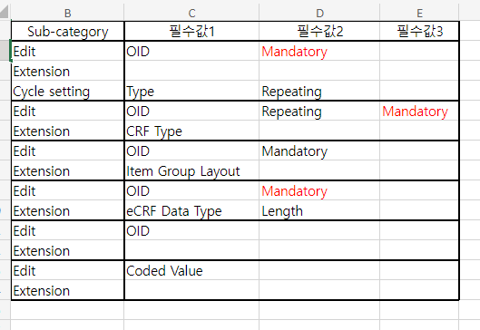

오늘 할 일

## eCRF Edit

- [ ] 카드 리스트 아이템 아이콘 적용 - 요청 드린 상태

- [x] Cycle Type 제한
  1. Cycle이 UV, All visit일 경우, Cycle Type 을 설정할 수 없어야 함
  2. Cycle이 일반 Visit 일 경우, Normal Type, Follow-up Type 만 설정할 수 있어야 함

- [x] eCRF Edit 필수 필드 확인
- [x] eCRF Edit Mandatory Field 추가
- 

- [x] (BAL-1891) eCRF Edit 카드 Confirm 시 유효성 검사 및 경고 출력
- [x] (BAL-1892) eCRF Edit Save 시 유효성 검사 및 경고 출력
- [x] Data Format 이라 바꾼 여기가 맞나? - extension의 length여씀

## Defined Visit

- [x] Visit Name 길어질 경우 경고 아이콘 작아지는 문제 해결
- [ ] ~~Confirm 시 리스트에 에러 없애기~~ / eCRF Edit도 똑같이 처리하기

## SoA
- [x] 필드 체크박스 오른쪽 정렬


## 잘못된 부분
1. Procedure Edit 화면 BiomedicalConcept 띄어쓰기 없음
2. Workspace Form 라디오버튼 검은색(메인색상이어야함)
  - Figma Defined Visit과 다름, 통일 필요

```js
// 예를 들어, 페이지 이동 시 이벤트를 감지하고 저장하지 않은 내용이 있는 경우 경고를 표시하는 코드

import { useEffect } from 'react';
import { useRouter } from 'next/router';

const MyPage = () => {
    const router = useRouter();

    useEffect(() => {
        const handleRouteChange = (url) => {
            // 여기에서 저장하지 않은 내용 체크 로직을 추가합니다.
            const unsavedChanges = checkUnsavedChanges(); // 예시 함수

            if (unsavedChanges) {
                const confirmNavigation = window.confirm('저장되지 않은 내용이 있습니다. 정말로 이동하시겠습니까?');

                if (!confirmNavigation) {
                    router.events.emit('routeChangeError'); // 이벤트를 발생시켜 페이지 이동을 취소합니다.
                    router.replace(router.asPath); // 현재 경로로 다시 이동합니다.
                }
            }
        };

        router.events.on('routeChangeStart', handleRouteChange);

        return () => {
            router.events.off('routeChangeStart', handleRouteChange);
        };
    }, []);

    return (
        <div>
            {/* 페이지 내용 */}
        </div>
    );
};

export default MyPage;

```
